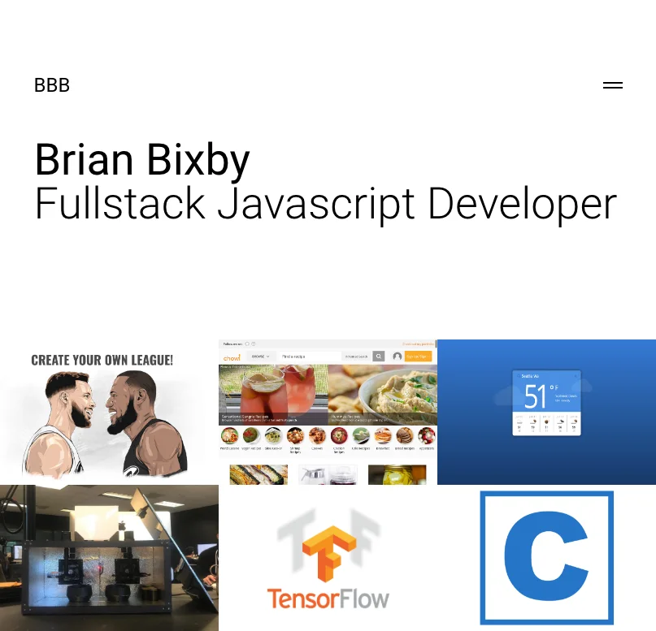

# Portfolio-React

[](https://opensource.org/licenses/ISC)

## Description

This single-page application is my portfolio. Additionally, I utilized [Create React App](https://create-react-app.dev/), and [Redux](https://redux.js.org/) for the front end, along with associated packages for routing and styling.

## Table of Contents

- [Installation](#installation)
- [Usage](#usage)
- [Product](#product)
- [Questions](#questions)
- [Technology](#technology)
- [License](#license)

## Installation

Prerequisites: Node & NPM

```bash
git clone https://github.com/brianbixby/Portfolio-React.git
cd Portfolio-React
npm run install
create a .env file based on the .env-sample
*** Note: you will need a backend for this app to work: mine is located at: https://github.com/brianbixby/portfolio-backend ***
```

## Usage

- The application will be invoked by using the following commands:

```bash
npm run start
*** open http://localhost:3000/ ***
```

## Product



[Live Site](https://intense-spire-62825.herokuapp.com/)

## Questions

If you have any questions please don't hesitate to reach out:
[Github](https://github.com/brianbixby)
[Email](mailto:brianbixby0@gmail.com)

## Technology

- [Github](https://github.com/brianbixby/https://github.com/brianbixby/Portfolio-React)
- [Create React App](https://create-react-app.dev/)
- [react](https://reactjs.org/)
- [react-dom](https://reactjs.org/docs/react-dom.html)
- [react-redux](https://react-redux.js.org/)
- [react-router](https://reactrouter.com/)
- [react-router-dom](https://www.npmjs.com/package/react-router-dom)
- [redux](https://redux.js.org/)
- [redux-devtools-extension](https://www.npmjs.com/package/redux-devtools-extension)
- [redux-logger](https://www.npmjs.com/package/redux-logger)
- [sass](https://www.npmjs.com/package/sass)
- [superagent](https://www.npmjs.com/package/superagent)
- [validator](https://www.npmjs.com/package/validator)
- [dotenv](https://www.npmjs.com/package/dotenv)

## License

Copyright 2022 Brian Bixby

Permission to use, copy, modify, and/or distribute this software for any purpose with or without fee is hereby granted, provided that the above copyright notice and this permission notice appear in all copies.

THE SOFTWARE IS PROVIDED "AS IS" AND THE AUTHOR DISCLAIMS ALL WARRANTIES WITH REGARD TO THIS SOFTWARE INCLUDING ALL IMPLIED WARRANTIES OF MERCHANTABILITY AND FITNESS. IN NO EVENT SHALL THE AUTHOR BE LIABLE FOR ANY SPECIAL, DIRECT, INDIRECT, OR CONSEQUENTIAL DAMAGES OR ANY DAMAGES WHATSOEVER RESULTING FROM LOSS OF USE, DATA OR PROFITS, WHETHER IN AN ACTION OF CONTRACT, NEGLIGENCE OR OTHER TORTIOUS ACTION, ARISING OUT OF OR IN CONNECTION WITH THE USE OR PERFORMANCE OF THIS SOFTWARE.
